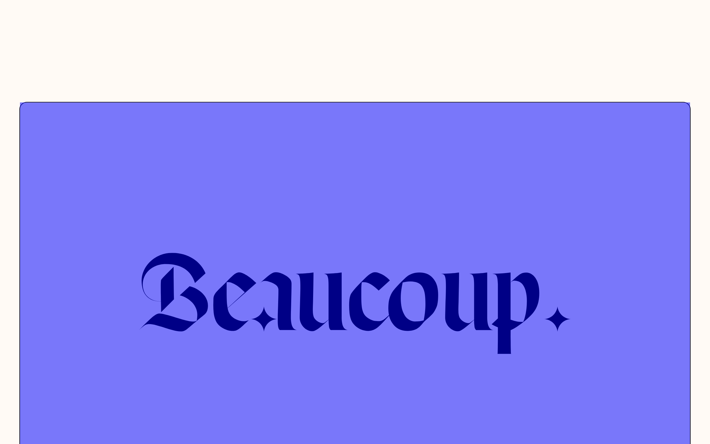

# beaucoup Design System

You are building UI for **beaucoup**. Light-themed, warm palette, sans-serif typography (Cirka), standard density on a 5px grid, flat elevation (no shadows).

## Visual Reference

**IMPORTANT**: Study ALL screenshots below before writing any UI. Match colors, typography, spacing, layout, and motion exactly as shown.

### Homepage



> Read `references/DESIGN.md` for full token details.

## Design Philosophy

- **Gradient accents** — gradients are used thoughtfully for emphasis, not decoration.
- **Type pairing** — Cirka for body/UI text, PP Neue Montreal for headings/display. Never introduce a third typeface.
- **standard density** — 5px base grid. Every dimension is a multiple of 5.
- **warm palette** — the color temperature runs warm, matching the sans-serif typography.
- **Restrained accent** — `#d8c8b8` is the only pop of color. Used exclusively for CTAs, links, focus rings, and active states.
- **Subtle motion** — transitions smooth state changes. Keep durations under 300ms, use ease-out curves.

## Color System

### Core Palette

| Role | Token | Hex | Use |
|------|-------|-----|-----|
| Background | `--background` | `#fffaf5` | Page/app background |
| Surface | `--surface` | `#e8e8e8` | Cards, panels, modals |
| Text Primary | `--text-primary` | `#080808` | Headings, body text |
| Text Muted | `--text-muted` | `#a8b8b8` | Captions, placeholders |
| Accent | `--accent` | `#d8c8b8` | CTAs, links, focus rings |

### Status Colors

| Status | Hex | Use |
|--------|-----|-----|
| Warning | `#d8c8a8` | Caution states, pending items |

### Extended Palette

- **theme-color:** `#0000ff`
- `#c8c8c8`
- `#d8d8c8`
- `#d8d8e8`
- `#001887`
- `#000012` — Deep background layer or shadow color
- `#181828`
- `#98a8b8`

## Typography

### Font Stack

- **Cirka** — Heading 1, Heading 2, Heading 3
- **PP Neue Montreal** — Body, Caption

### Font Sources

```css
@font-face {
  font-family: "PP Neue Montreal";
  src: url("fonts/PPNeueMontreal-Regular.woff2") format("woff2");
  font-weight: 400;
}
@font-face {
  font-family: "PP Neue Montreal";
  src: url("fonts/PPNeueMontreal-700.woff2") format("woff2");
  font-weight: 700;
}
@font-face {
  font-family: "Cirka";
  src: url("fonts/Cirka-700.woff2") format("woff2");
  font-weight: 700;
}
@font-face {
  font-family: "Cirka";
  src: url("fonts/Cirka-Regular.woff2") format("woff2");
  font-weight: 400;
}
```

### Type Scale

| Role | Family | Size | Weight |
|------|--------|------|--------|
| Heading 1 | Cirka | 40px | 700 |
| Heading 2 | Cirka | 20px | 700 |
| Heading 3 | Cirka | 12px | 700 |
| Body | PP Neue Montreal | var(--size-12) | 400 |
| Caption | PP Neue Montreal | 12.800vw | 400 |

### Typography Rules

- Body/UI: **Cirka**, Headings: **PP Neue Montreal** — these are the only display fonts
- Max 3-4 font sizes per screen
- Headings: weight 600-700, body: weight 400
- Use color and opacity for text hierarchy, not additional font sizes
- Line height: 1.5 for body, 1.2 for headings

## Spacing & Layout

### Base Grid: 5px

Every dimension (margin, padding, gap, width, height) must be a multiple of **5px**.

### Spacing Scale

`5, 10, 15, 20, 25, 30, 50, 60` px

### Spacing as Meaning

| Spacing | Use |
|---------|-----|
| 2.5-5px | Tight: related items within a group |
| 10px | Medium: between groups |
| 15-20px | Wide: between sections |
| 30px+ | Vast: major section breaks |

### Border Radius

Scale: `1.04vw, 1.042vw, 3.472vw, 6.944vw, 15px, 50px, 100%, 100px`
Default: `15px`

### Container

Max-width: `1199.98px`, centered with auto margins.

### Breakpoints

| Name | Value |
|------|-------|
| md | 768px |
| xl | 1199.98px |
| xl | 1200px |
| 2xl | 1400px |

Mobile-first: design for small screens, layer on responsive overrides.

## Component Patterns

### Card

```css
.card {
  background: #e8e8e8;
  border-radius: 15px;
  padding: 20px;
}
```

```html
<div class="card">
  <h3>Card Title</h3>
  <p>Card content goes here.</p>
</div>
```

### Button

```css
/* Primary */
.btn-primary {
  background: #d8c8b8;
  color: #080808;
  border-radius: 15px;
  padding: 10px 20px;
  font-weight: 500;
  transition: opacity 150ms ease;
}
.btn-primary:hover { opacity: 0.9; }

/* Ghost */
.btn-ghost {
  background: transparent;
  border: 1px solid #cccccc;
  color: #080808;
  border-radius: 15px;
  padding: 10px 20px;
}
```

```html
<button class="btn-primary">Get Started</button>
<button class="btn-ghost">Learn More</button>
```

### Input

```css
.input {
  background: #fffaf5;
  border: 1px solid #cccccc;
  border-radius: 15px;
  padding: 10px 15px;
  color: #080808;
  font-size: 14px;
}
.input:focus { border-color: #d8c8b8; outline: none; }
```

```html
<input class="input" type="text" placeholder="Search..." />
```

### Badge / Chip

```css
.badge {
  display: inline-flex;
  align-items: center;
  padding: 5px 10px;
  border-radius: 9999px;
  font-size: 12px;
  font-weight: 500;
  background: #e8e8e8;
  color: #a8b8b8;
}
```

```html
<span class="badge">New</span>
<span class="badge">Beta</span>
```

### Modal / Dialog

```css
.modal-backdrop { background: rgba(0, 0, 0, 0.6); }
.modal {
  background: #e8e8e8;
  border-radius: 100px;
  padding: 30px;
  max-width: 480px;
  width: 90vw;
}
```

```html
<div class="modal-backdrop">
  <div class="modal">
    <h2>Dialog Title</h2>
    <p>Dialog content.</p>
    <button class="btn-primary">Confirm</button>
    <button class="btn-ghost">Cancel</button>
  </div>
</div>
```

### Table

```css
.table { width: 100%; border-collapse: collapse; }
.table th {
  text-align: left;
  padding: 10px 15px;
  font-weight: 500;
  font-size: 12px;
  color: #a8b8b8;
  text-transform: uppercase;
  letter-spacing: 0.05em;
  border-bottom: 1px solid #cccccc;
}
.table td {
  padding: 15px;
  border-bottom: 1px solid #cccccc;
}
```

```html
<table class="table">
  <thead><tr><th>Name</th><th>Status</th><th>Date</th></tr></thead>
  <tbody>
    <tr><td>Item One</td><td>Active</td><td>Jan 1</td></tr>
    <tr><td>Item Two</td><td>Pending</td><td>Jan 2</td></tr>
  </tbody>
</table>
```

### Navigation

```css
.nav {
  display: flex;
  align-items: center;
  gap: 10px;
  padding: 15px 20px;
}
.nav-link {
  color: #a8b8b8;
  padding: 10px 15px;
  border-radius: 15px;
  transition: color 150ms;
}
.nav-link:hover { color: #080808; }
.nav-link.active { color: #d8c8b8; }
```

```html
<nav class="nav">
  <a href="/" class="nav-link active">Home</a>
  <a href="/about" class="nav-link">About</a>
  <a href="/pricing" class="nav-link">Pricing</a>
  <button class="btn-primary" style="margin-left: auto">Get Started</button>
</nav>
```

## Page Structure

The following page sections were detected:

- **Hero** — Hero section (detected from heading structure)
- **Footer** — Page footer with links and info (8 items)

When building pages, follow this section order and structure.

## Animation & Motion

This project uses **subtle motion**. Transitions smooth state changes without calling attention.

### Motion Tokens

- **Duration scale:** `50ms`, `200ms`, `250ms`, `300ms`, `400ms`, `500ms`, `700ms`
- **Easing functions:** `linear`, `cubic-bezier(0.23,1,0.32,1)`
- **Animated properties:** `opacity`

### Motion Guidelines

- **Duration:** Use values from the duration scale above. Short (50ms) for micro-interactions, long (700ms) for page transitions
- **Easing:** Use `linear` as the default easing curve
- **Direction:** Elements enter from bottom/right, exit to top/left
- **Reduced motion:** Always respect `prefers-reduced-motion` — disable animations when set

## Depth & Elevation

This design uses **flat elevation** — no box-shadows anywhere.

### Elevation Strategy

| Level | Technique | Use |
|-------|-----------|-----|
| 0 — Base | Background color | Page background |
| 1 — Raised | Lighter surface + subtle border | Cards, panels |
| 2 — Floating | Even lighter surface + stronger border | Dropdowns, popovers |
| 3 — Overlay | Backdrop + modal surface | Modals, dialogs |

### Z-Index Scale

`0, 1, 2, 3, 4, 5, 9, 10, 15, 100, 998, 999, 9999`

Use these exact values — never invent z-index values.

## Anti-Patterns (Never Do)

- **No box-shadow** on any element — use borders and surface colors for depth
- **No blur effects** — no backdrop-blur, no filter: blur()
- **No zebra striping** — tables and lists use borders for separation
- **No invented colors** — every hex value must come from the palette above
- **No arbitrary spacing** — every dimension is a multiple of 5px
- **No extra fonts** — only Cirka and PP Neue Montreal are allowed
- **No arbitrary border-radius** — use the scale: 15px, 50px, 100px
- **No opacity for disabled states** — use muted colors instead
- **No pill shapes** — this design doesn't use rounded-full / 9999px radius

## Workflow

1. **Read** `references/DESIGN.md` before writing any UI code
2. **Pick colors** from the Color System section — never invent new ones
3. **Set typography** — Cirka, PP Neue Montreal only, using the type scale
4. **Build layout** on the 5px grid — check every margin, padding, gap
5. **Match components** to patterns above before creating new ones
6. **Apply elevation** — flat, surface color shifts only
7. **Validate** — every value traces back to a design token. No magic numbers.

## Brand Spec

- **Favicon:** `/favicon-32x32.png`
- **Site URL:** `https://beaucoup.studio/en/`
- **Brand color:** `#d8c8b8`
- **Brand typeface:** Cirka

## Quick Reference

```
Background:     #fffaf5
Surface:        #e8e8e8
Text:           #080808 / #a8b8b8
Accent:         #d8c8b8
Border:         (not extracted)
Font:           Cirka
Spacing:        5px grid
Radius:         15px
Components:     5 detected
```

## When to Trigger

Activate this skill when:
- Creating new components, pages, or visual elements for beaucoup
- Writing CSS, Tailwind classes, styled-components, or inline styles
- Building page layouts, templates, or responsive designs
- Reviewing UI code for design consistency
- The user mentions "beaucoup" design, style, UI, or theme
- Generating mockups, wireframes, or visual prototypes

---

# Full Reference Files

> Every output file is embedded below. Claude has full design system context from /skills alone.

## Design System Tokens (DESIGN.md)

# beaucoup DESIGN.md

> Auto-generated design system — reverse-engineered via static analysis by skillui.
> Frameworks: None detected
> Colors: 20 · Fonts: 2 · Components: 5
> Icon library: not detected · State: not detected
> Primary theme: light · Dark mode toggle: no · Motion: subtle

## Visual Reference

**Match this design exactly** — study colors, fonts, spacing, and component shapes before writing any UI code.


---

## 1. Visual Theme & Atmosphere

This is a **light-themed** interface with a warm, approachable feel. The light background emphasizes content clarity. Typography pairs **PP Neue Montreal** for display/headings with **Cirka** for body text, creating clear visual hierarchy through type contrast. Spacing follows a **5px base grid** (standard density), with scale: 5, 10, 15, 20, 25, 30, 50, 60px. The palette is predominantly monochromatic with **#d8c8b8** as the single accent color — used sparingly for interactive elements and emphasis. Motion is subtle — smooth transitions (150-300ms) ease state changes without drawing attention.

---

## 2. Color Palette & Roles

| Token | Hex | Role | Use |
|---|---|---|---|
| background | `#fffaf5` | background | Page background, darkest surface |
| surface | `#e8e8e8` | surface | Card and panel backgrounds |
| text-primary | `#080808` | text-primary | Headings and body text |
| text-muted | `#a8b8b8` | text-muted | Captions, placeholders, secondary info |
| accent | `#d8c8b8` | accent | CTAs, links, focus rings, active states |
| warning | `#d8c8a8` | warning | Warning states, caution indicators |
| theme-color | `#0000ff` | info | Informational highlights |
| unknown | `#c8c8c8` | unknown | Palette color |
| unknown | `#d8d8c8` | unknown | Palette color |
| unknown | `#d8d8e8` | unknown | Palette color |
| unknown | `#001887` | unknown | Palette color |
| unknown | `#000012` | unknown | Palette color |
| unknown | `#181828` | unknown | Palette color |
| unknown | `#98a8b8` | unknown | Palette color |
| unknown | `#281818` | unknown | Palette color |
| unknown | `#181818` | unknown | Palette color |
| unknown | `#c8f8f8` | unknown | Palette color |
| unknown | `#d8d8d8` | unknown | Palette color |
| unknown | `#b8b8b8` | unknown | Palette color |
| unknown | `#687888` | unknown | Palette color |


---

## 3. Typography Rules

**Font Stack:**
- **Cirka** — Heading 1, Heading 2, Heading 3
- **PP Neue Montreal** — Body, Caption

**Font Sources:**

```css
@font-face {
  font-family: "PP Neue Montreal";
  src: url("fonts/PPNeueMontreal-Regular.woff2") format("woff2");
  font-weight: 400;
}
@font-face {
  font-family: "PP Neue Montreal";
  src: url("fonts/PPNeueMontreal-700.woff2") format("woff2");
  font-weight: 700;
}
@font-face {
  font-family: "Cirka";
  src: url("fonts/Cirka-700.woff2") format("woff2");
  font-weight: 700;
}
@font-face {
  font-family: "Cirka";
  src: url("fonts/Cirka-Regular.woff2") format("woff2");
  font-weight: 400;
}
```

| Role | Font | Size | Weight |
|---|---|---|---|
| Heading 1 | Cirka | 40px | 700 |
| Heading 2 | Cirka | 20px | 700 |
| Heading 3 | Cirka | 12px | 700 |
| Body | PP Neue Montreal | var(--size-12) | 400 |
| Caption | PP Neue Montreal | 12.800vw | 400 |

**Typographic Rules:**
- Limit to 2 font families max per screen
- Use **Cirka** for body/UI text, **PP Neue Montreal** for display/headings
- Maintain consistent hierarchy: no more than 3-4 font sizes per screen
- Headings use bold (600-700), body uses regular (400)
- Line height: 1.5 for body text, 1.2 for headings
- Use color and opacity for secondary hierarchy, not additional font sizes


---

## 4. Component Stylings

### Layout (1)

**Footer** — `html`

### Navigation (1)

**Navigation** — `html`

### Media (3)

**Image** — `html`

**Icon** — `html`

**Map/Canvas** — `html`


---

## 5. Layout Principles

- **Base spacing unit:** 5px
- **Spacing scale:** 5, 10, 15, 20, 25, 30, 50, 60
- **Border radius:** 1.04vw, 1.042vw, 3.472vw, 6.944vw, 15px, 50px, 100%, 100px
- **Max content width:** 1199.98px

**Spacing as Meaning:**
| Spacing | Use |
|---|---|
| 2.5-5px | Tight: related items within a group |
| 10px | Medium: between groups |
| 15-20px | Wide: between sections |
| 30px+ | Vast: major section breaks |


---

## 6. Depth & Elevation

No box-shadow values detected. The design appears to use a flat visual style.

**Z-Index Scale:** `0, 1, 2, 3, 4, 5, 9, 10, 15, 100, 998, 999, 9999`


---

## 7. Animation & Motion

This project uses **subtle motion**. Transitions smooth state changes without demanding attention.

### Motion Guidelines

- Duration: 150-300ms for micro-interactions, 300-500ms for page transitions
- Easing: `ease-out` for enters, `ease-in` for exits
- Always respect `prefers-reduced-motion`


---

## 8. Do's and Don'ts

### Do's

- Use `#d8c8b8` for interactive elements (buttons, links, focus rings)
- Use `#fffaf5` as the primary page background
- Pair **Cirka** (body) with **PP Neue Montreal** (display) — these are the only allowed fonts
- Follow the **5px** spacing grid for all margins, padding, and gaps
- Use border and background shifts for elevation — not shadows
- Use border-radius from the scale: 1.04vw, 1.042vw, 3.472vw, 6.944vw, 15px
- Reuse existing components from Section 4 before creating new ones

### Don'ts

- Don't introduce colors outside this palette — extend the design tokens first
- Don't introduce additional font families beyond Cirka and PP Neue Montreal
- Don't use arbitrary spacing values — stick to multiples of 5px
- Don't add box-shadow — this design system uses flat elevation
- Don't use arbitrary border-radius values — pick from the defined scale
- Don't duplicate component patterns — check Section 4 first
- Don't use backdrop-blur or blur effects

### Anti-Patterns (detected from codebase)

- No box-shadow on any element
- No blur or backdrop-blur effects
- No zebra striping on tables/lists


---

## 9. Responsive Behavior

| Name | Value | Source |
|---|---|---|
| md | 768px | css |
| xl | 1199.98px | css |
| xl | 1200px | css |
| 2xl | 1400px | css |

**Approach:** Use `@media (min-width: ...)` queries matching the breakpoints above.


---

## 10. Agent Prompt Guide

Use these as starting points when building new UI:

### Build a Card

```
Background: #e8e8e8
Border: 1px solid var(--border)
Radius: 15px
Padding: 20px
Font: Cirka
No shadows — use borders and surface colors for depth.
```

### Build a Button

```
Primary: bg #d8c8b8, text white
Ghost: bg transparent, border var(--border)
Padding: 10px 20px
Radius: 15px
Hover: opacity 0.9 or lighter shade
Focus: ring with #d8c8b8
```

### Build a Page Layout

```
Background: #fffaf5
Max-width: 1199.98px, centered
Grid: 5px base
Responsive: mobile-first, breakpoints from Section 9
```

### Build a Stats Card

```
Surface: #e8e8e8
Label: #a8b8b8 (muted, 12px, uppercase)
Value: #080808 (primary, 24-32px, bold)
Status: use success/warning/danger from Section 2
```

### Build a Form

```
Input bg: #fffaf5
Input border: 1px solid var(--border)
Focus: border-color #d8c8b8
Label: #a8b8b8 12px
Spacing: 20px between fields
Radius: 15px
```

### General Component

```
1. Read DESIGN.md Sections 2-6 for tokens
2. Colors: only from palette
3. Font: Cirka, type scale from Section 3
4. Spacing: 5px grid
5. Components: match patterns from Section 4
6. Elevation: flat, surface shifts
```

## Bundled Fonts (fonts/)

The following font files are bundled in the `fonts/` directory:

- `fonts/Cirka-300.woff`
- `fonts/Cirka-300.woff2`
- `fonts/Cirka-700.woff`
- `fonts/Cirka-700.woff2`
- `fonts/Cirka-Regular.woff`
- `fonts/Cirka-Regular.woff2`
- `fonts/PPNeueMontreal-100.woff`
- `fonts/PPNeueMontreal-100.woff2`
- `fonts/PPNeueMontreal-500.woff`
- `fonts/PPNeueMontreal-500.woff2`
- `fonts/PPNeueMontreal-600.woff`
- `fonts/PPNeueMontreal-600.woff2`
- `fonts/PPNeueMontreal-700.woff`
- `fonts/PPNeueMontreal-700.woff2`
- `fonts/PPNeueMontreal-Regular.woff`
- `fonts/PPNeueMontreal-Regular.woff2`

Use these local font files in `@font-face` declarations instead of fetching from Google Fonts.

## Homepage Screenshots (screenshots/)


